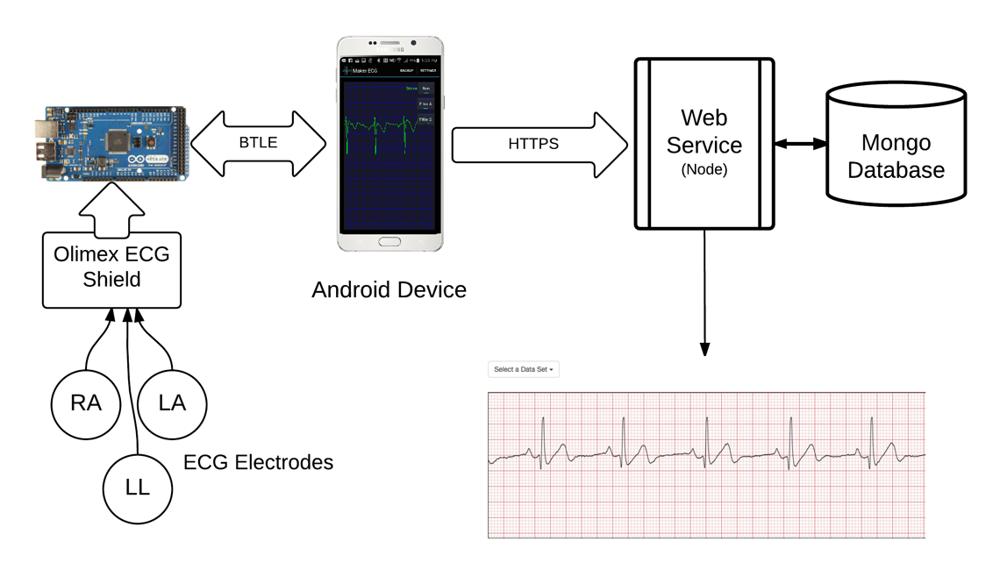

# ecgkit
An Arduino Electrocardiograph project using the Arduino ADK and Olimex ECG Shield

This is an Android application with accompanying Ardiuno and Node.JS server code to collect and plot ECG data on both the Android device and (soon) a server.

**Hardware Requirments**
- Android Device running Android 4.4.2 or later
- Android ADK (any version; available from a number of sources)
- Bluetooth LE dongle to connect from the Arduino ADK to the phone/tablet
- Olimex ECG Shield - model ID SHIELD-EKG-EMG (I ordered from Digi-key).
- Electrodes and cabling - Olimex also produces some covenient electrode cabling for use with their shield: mode ID SHIELD-EKG-EMG-PRO. This particular cable requires disposable ECG Electrodes (I ordered these from Cables and Sensors).
- (optional) A Linux/OS X/Windows server capable of running Node.JS and Mongo DB.

**Arduino Build Notes**
Built using Arduino tools 1.6.7
Download the Google Accessory Development Kit 2011 edition
http://developer.android.com/tools/adk/adk.html
https://dl-ssl.google.com/android/adk/adk_release_20120606.zip

**Android Build Notes**
Using Android Studio 1.5.1

**Server**